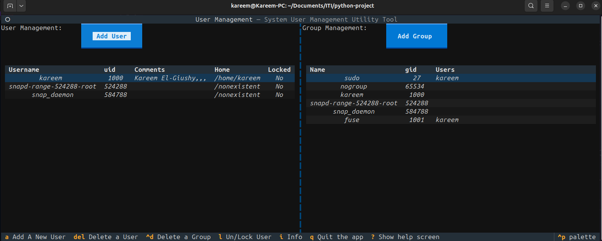
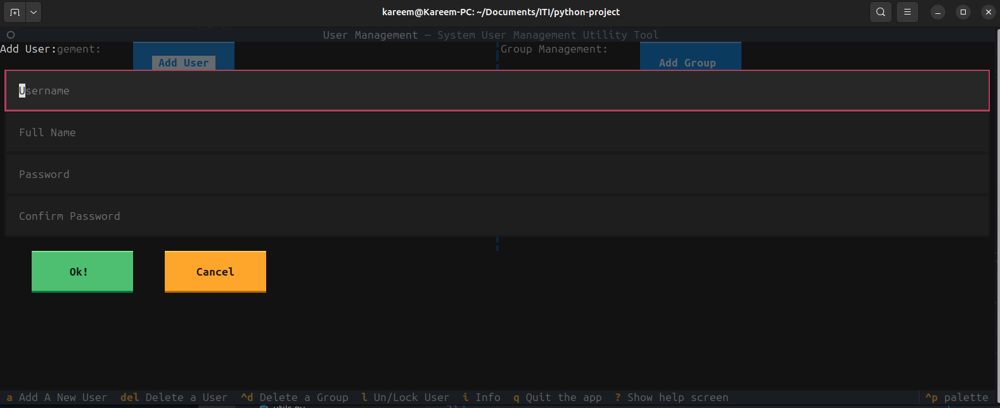

# User Management Utility

A robust, keyboard-centric Terminal User Interface (TUI) for managing system users and groups. Built with **Python** and the **Textual** framework, this utility provides a streamlined way to handle administrative tasks without leaving the terminal.

## 🚀 Features

* **Dual-Pane Management:** View and manage Users and Groups side-by-side.
* **User CRUD:** Add, delete, and modify user details (Full Name, Passwords).
* **Group Management:** Create or delete groups and modify group memberships.
* **Real-time Validation:** Built-in input validation for usernames and password complexity.
* **Interactive Modals:** Dedicated screens for adding and editing entries to prevent accidental changes.
* **Keyboard Driven:** Optimized with hotkeys for power users.

## ⌨️ Key Bindings

| Key | Action |
| --- | --- |
| `a` | Add a New User |
| `Delete` | Delete selected User |
| `Ctrl + d` | Delete selected Group |
| `l` | Lock/Unlock User |
| `q` | Quit Application |
| `?` | Show Help |

---

## 📸 Screenshots
### Dashboard


### User Creation


---

## 🛠️ Installation & Usage

### Prerequisites

* Python 3.8+
* A terminal that supports true color (most modern terminals)

### Setup

1. Clone the repository:
```bash
git clone https://github.com/yourusername/User-Management-Utility-tool-tui.git
cd User-Management-Utility-tool-tui

```


2. Install dependencies:
```bash
pip install textual rich

```


3. Run the application:
```bash
python main.py

```


## 🏗️ Project Structure

* `main.py`: The core Textual application and screen logic.
* `utils.py`: Backend logic for system calls (add/delete/modify users).
* `validators.py`: Custom logic for validating terminal input.
* `style.tcss`: CSS-like styling for the terminal interface.


Made With ❤️ By Kareem El-Giushy :)